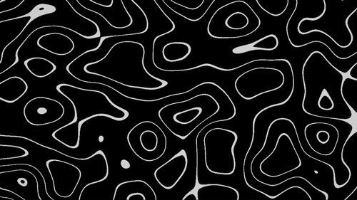

# Unity Shader Graph Collection

This is a personal collection of shaders made using Unity Shader Graph. Each shader includes a preview and can be used or modified freely in personal projects.

---

## 1. Abstract Lines

A looping shader that creates a dynamic, flowing line pattern based on 3D noise.

Inspired by [Perlin Noise](https://www.ronja-tutorials.com/post/026-perlin-noise/) from Ronja's tutorials
Built using [Noisy Nodes](https://github.com/JimmyCushnie/Noisy-Nodes) by JimmyCushnie.

> Designed for Unity 2022+ using URP + Shader Graph

---

More shaders coming soon...
